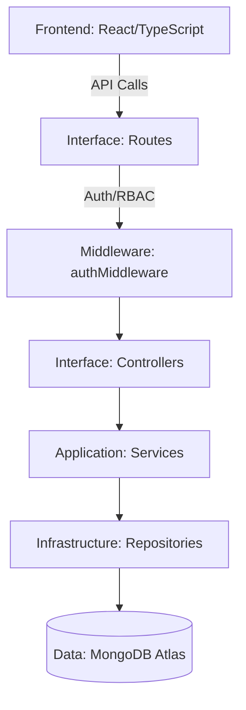

# FinanceFlow: Finance Dashboard Dashboard Backend & Frontend

[](https://www.typescriptlang.org/)
[](https://expressjs.com/)
[](https://react.dev/)
[](https://www.mongodb.com/)

A high-performance, production-ready finance dashboard and backend system built on **Clean Architecture** principles. Designed for scalability, security, and granular access control.

---

## 🏗️ Clean & Scalable Architecture

This project follows a strict **Separation of Concerns** to ensure maintainability and testability.

### Architecture Overview


### Key Technical Pillars
1.  **Repository Pattern**: Data access is abstracted behind repositories, allowing for seamless transitions between database providers.
2.  **Aggregation Pipelines**: Advanced MongoDB aggregation is used for 100% of the dashboard metrics, ensuring minimal overhead and maximal database efficiency.
3.  **Strict Type Safety**: Full TypeScript integration across all layers, from schemas to API responses.
4.  **Zod Validation**: Robust input schema validation to prevent malformed data from entering our system.

---

## 🔐 Advanced Role-Based Access Control (RBAC)

The system implements a granular role hierarchy to satisfy complex enterprise requirements:

| Feature              | **VIEWER** | **ANALYST** | **ADMIN** |
| :------------------- | :--------: | :---------: | :-------: |
| **View Dashboard**   | ✅ (Own) | ✅ (All) | ✅ (All) |
| **History Access**   | ✅ (Own) | ✅ (All) | ✅ (All) |
| **Analytics Access** | ✅ | ✅ | ✅ |
| **Create Records**   | ❌ | ❌ | ✅ |
| **Edit Records**     | ❌ | ❌ | ✅ |
| **Delete Records**   | ❌ | ❌ | ✅ |
| **User Management**  | ❌ | ❌ | ✅ |

---

## 🛠️ Project Setup & Installation

### Prerequisites
- Node.js (v18.x or higher)
- MongoDB (Running instance or Atlas)
- NPM or Yarn

### Backend Installation
1.  **Navigate to the backend directory**:
    ```bash
    cd backend
    ```
2.  **Install dependencies**:
    ```bash
    npm install
    ```
3.  **Environment Configuration**: Create a `.env` file based on the template below:
    ```env
    PORT=3000
    MONGODB_URI=mongodb+srv://<user>:<pwd>@cluster.mongodb.net/finance
    JWT_SECRET=your_jwt_access_secret_key
    JWT_REFRESH_SECRET=your_jwt_refresh_secret_key
    FRONTEND_URL=http://localhost:5173
    ```
4.  **Launch the development server**:
    ```bash
    npm run dev
    ```

### Frontend Installation
1.  **Navigate to the frontend directory**:
    ```bash
    cd frontend
    ```
2.  **Install node modules**:
    ```bash
    npm install
    ```
3.  **Run the application**:
    ```bash
    npm run dev
    ```

---

## 📚 API Documentation

Detailed documentation for all available endpoints can be found in our dedicated **[API Documentation Guide](API_DOCUMENTATION.md)**.

### Quick Start: AuthFlow
1.  **POST** `/api/auth/signup` - Register a new account.
2.  **POST** `/api/auth/login` - Authenticate and receive high-level access tokens.
3.  **GET** `/api/dashboard/summary` - Access the real-time financial overview.

---

## 📊 Analytics & Aggregation

We leverage the full power of MongoDB's aggregation framework:
- **Real-time Totals**: Instant calculation of Balance, Expenses, and Income via `$group` and `$project`.
- **Intelligent Trends**: Dynamic month-over-month trend analysis utilizing the Date aggregation framework.
- **Category Visualization**: Automated categorization breakdown across various sectors (Salary, Transport, Food, etc.).

---

## 🤝 Contribution & Maintenance
- **Linting**: Keep code clean by adhering to the strictly typed standards.
- **Testing**: Ensure and verify RBAC middleware remains unbreachable.
- **Performance**: High-intensity dashboard queries must always use indexed fields.

---

> [!NOTE]
> Designed and optimized to meet industry-standard practices for financial dashboard systems.
